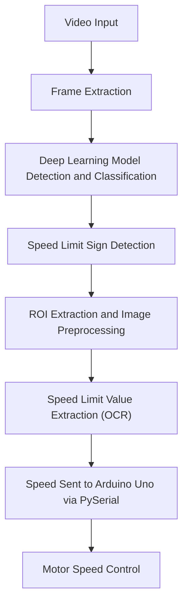

# AI-Based Speed Limit Detection and Speed Limiter System
# Description
Overspeeding is one of the leading causes of road accidents worldwide. This project aims to develop a system that detects traffic signs, extracts speed limits, and transmits the detected speed to a speed-limiting system that automatically controls the vehicle's speed.

## Flow Chart

